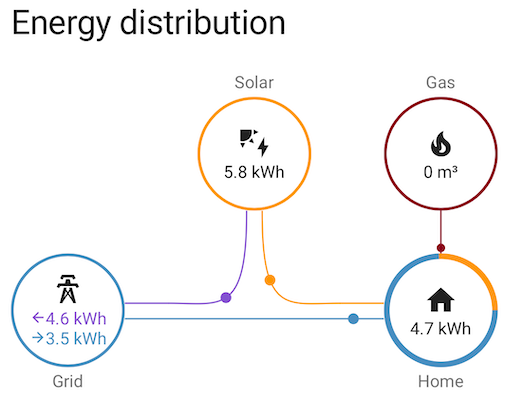
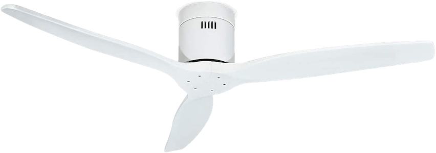
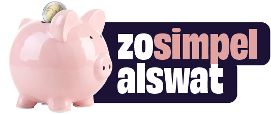

# Domotica en Energie Besparen

---

## Intro

HomeAutomation begonnen als "fun"

maar is ondertussen uitgegroeid

tot een middel om kosten te reduceren.

---

## Nutsbedrijf

> Een nutsbedrijf is een bedrijf dat, vaak vanuit een monopoliepositie, opereert in een sector die beschouwd wordt zijnde van openbaar nut omdat het belangrijke producten of diensten levert die in het algemeen belang zijn.

--

## Primaire nuts diensten

- Elektriciteit
- Gas
- Water

--

## Secundaire nuts diensten

- Communicatiesector: post, telegrafie, telefonie, internet
- Transportsector: het openbaar vervoer en het goederenvervoer per spoor
- Sociale woningbouw

--

## Nuts afhankelijkheid

We zijn afhankelijk van de nuts bedrijven en van de wetgeving. Volledig autonoom is een utopie.

---

## Waar kunnen we
## invloed uitoefenen
## op de
## primaire nuts diensten?

--

## Elektriciteit

- Elektriciteit besparen:
  - minder gebruiken en/of efficienter inzetten
- Elektriciteit opwekken:
  - terugleveren / verbruiken / opslaan

Problemen:
- afhankelijk van saldering's regeling en maatregelen van de regering
- terugleveren lijkt steeds minder rendabel

--

## Gas

- Gas besparen
    - minder gebruiken en/of efficienter gebruiken
- Biogas genereren (het is maar een idee)
    - terugleveren / verbruiken / opslaan

Problemen:
- prijzen blijven stijgen door schaarste,
    - positieve kanttekening: het prijs plafond lijkt in zicht
- van het "gas" af
- moeilijk zelf te produceren

--

## Water

- Water besparen
    - minder gebruiken / efficienter gebruiken b.v.
        - regenton
        - reservoir binnenshuis voor het doorspoelen van het toilet

Problemen:

- prijzen dreigen omhoog te gaan
- verspilling van kostbaar drinkwater

---

## Hoe pakken we dit aan?

- Informatie verzamelen
- Analyseren
- Acteren (en dan het liefst alles automatisch)

--

## Informatie verzamelen

Informatie verzamelen over

- het gebruik en
- de opbrengst

--

<!-- .slide: data-menu-title="Sonoff" data-background-image="img/Sonoff_POW.png" data-background-opacity="0.2" -->

### Verbruik

Stroomverbruik meten met een Sonoff POW:

- Afwasmachine
- Koelkast
- Oven
- Magnetron
- Wasmachine
- Droger

Hoogverbruikers / oude apparatuur vervangen door meer efficiente versies.
API / Remote control wordt steeds interessanter i.vm. saldering.

--

<!-- .slide: data-menu-title="Huis" data-background-image="img/home.jpg" data-background-opacity="0.5" -->

### Opbrengst zonnepanelen

Huidige situatie: zwaar overcapaciteit => veel electriciteit wordt tegen 7 cent terug geleverd

--

<!-- .slide: data-menu-title="SlimmeLezer" data-background-image="img/SlimmeLezer.png" data-background-opacity="0.2" -->

### P1 uitlezen

Opbrengst van de zonnepanelen via de P1 poort
uitlezen met de [SlimmeLezer](https://www.zuidwijk.com/product/slimmelezer/).

--

### HomeAssistant - Energie dashboard

 "Gistermorgen 4 oktober 2022"

---

## Mijn besparingen* door domotica

--

<!-- .slide: data-menu-title="Shelly1" data-background-image="img/Shelly1.png" data-background-opacity="0.2" -->

### Garage

Verlichting garage, twee led-armaturen, automatisch aan bij beweging, automatisch uit na 3 minuten.

- Shelly 1 en Aquara bewegings-sensor
- Verbeterpunt, meten hoeveel licht er is en o.b.v. daarvan niet het licht aanzetten.

--

<!-- .slide: data-menu-title="Shelly1" data-background-image="img/Shelly1.png" data-background-opacity="0.2" -->

### Hal

Verlichting hal, een led-lamp, automatisch aan bij beweging, automatisch uit na 3 minuten.

- Shelly 1 en Aquara bewegings-sensor
- Verbeterpunt, kortere tijdsduur

--

<!-- .slide: data-menu-title="Hue Badkamer lamp" data-background-image="img/hue_ceiling_light.jpeg" data-background-opacity="0.2" -->

### Badkamer

Verlichting badkamer, Hue badkamer lamp, automatisch aan bij beweging, automatisch uit na 3 minuten.

- Aquara bewegings-sensor
- Verbeterpunt, licht-intentie aanpassen aan omgevingslicht/tijdstip

--

<!-- .slide: data-menu-title="Slide App" data-background-image="img/Slide_App_Zones.png" data-background-opacity="0.2" -->

### Gordijnen

Gordijnen sluiten en openen automatisch d.m.v. "[Slide](https://nl.slide.store/)".

--

<!-- .slide: data-menu-title="Tado" data-background-image="img/Tado.jpeg" data-background-opacity="0.4" -->

### Verwarming

Verwarming d.m.v. Tado en "slimme" radiatorknoppen:

- Besparing door warme en koude zones in het huis.
- Persoonsherkenning, niemand thuis verwarming omlaag.

--

<!-- .slide: data-menu-title="Hue remote" data-background-image="img/Hue_remote.png" data-background-opacity="0.4" -->

### Hue ledverlichting

Hue ledverlichting in de woonkamer en kantoor/werkruimte.

- Knoppen aan de metalen kozijnen om de alle lampen eenvoudig aan en uit te zetten per kamer.

---

<!-- .slide: data-menu-title="Infrarood" data-background-image="img/Infraroodpaneel_onder_bureau.png" data-background-opacity="0.3" -->

## Besparing door infrarood panelen

Infrarood paneel onder het bureau:

- Stralingswarmte, niet voor iedere situatie geschikt.
- Verbruik van 150W stroom maximaal.
- Voordeliger dan de CV gas laten verstoken.

[Fiber plaat bureauverwarming zelfklevend inclusief dimmer](https://www.infraroodverwarmingstore.nl/fiber-plaat-bureauverwarming-inclusief-dimmer.html) investering 89 euro.

Andere optie is een [verplaatsbaar infrarood paneel](https://www.infraroodverwarmingstore.nl/qh-infrarood-paneel-50-x-90-cm-450watt.html?id=271426282)

---

## Besparing door ventilator en airco

Gebruik een airco in de winter

en een ventilator in de zomer!

---

## Externe hulp

Naast de domotica gerelateerde opties, lokale initiatieven.

--

<!-- .slide: data-menu-title="Duurzaam Groningen" data-background-image="img/Duurzaam_Groningen_Logo_Energieloket_Groningen.webp" data-background-opacity="0.2" -->

### [Duurzaam Groningen](https://regionaalenergieloket.nl/groningen) - Welkom bij het energieloket

- Cadeaubon aanvragen - en gebruiken, online of in een fysieke winkel.
- Gratis energiecoach
- Subsidieregeling Verduurzaming en Onderhoud Huurwoningen (SVOH)
- Subsidie Klimaat Groningen
    - Groen dak, regenwater berging, boompje planten
- Investeringssubsidie duurzame energie en energiebesparing voor woningeigenaren
    - Isolatiemaatregelen, warmtepompen, etc.

--

### [Zo simpel als wat](https://zosimpelalswat.nl/)

Tips om energie te besparen, sommige zinnig, sommige onzinnig.

"Trek de stekker uit het stopcontact als je hem niet gebruikt." - bespaart 90 euro per jaar

"Gebruik een ventilator in plaats van een airco."

---

## Conclusie

- Informatie verzamelen
    - waar zitten de grootverbruikers?
    - hoeveel opbrengst heb je?
- Analyseren
    - hoe kun je efficienter omgaan met de nuts diensten?
    - waar is het laaghangend fruit?
- Acteren (en dan het liefst alles automatisch)
    - actie!
    - vraag de cadeaubon en de energie coach aan.
    - kijk naar de mogelijke subsidies
    - automatiseer je huis

---

<!-- .slide: data-menu-title="That's all folks" data-background-image="img/Thats_all_Folks.jpg" data-background-opacity="1.0" -->